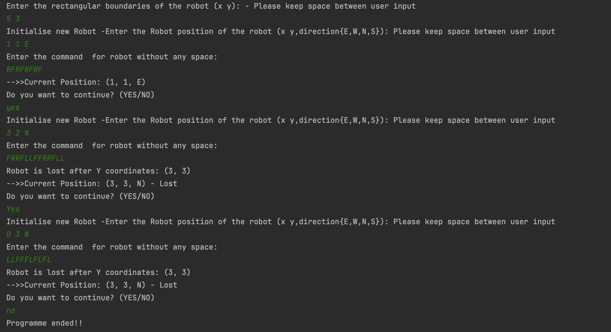

# Robotic Simulation

A simple Java application to simulate a robot moving within user-defined boundaries.

## Features

- Set rectangular boundaries for the robot.
- Initialize robot position and direction (E, W, N, S).
- Execute movement commands.
- Detect if the robot is lost (moves out of bounds).

## Requirements

- Java 8 or higher
- Maven

## Setup

1. Clone the repository:
```git clone https://github.com/gitabhishekbaloni/Robotic.git cd <repo-directory>```
2. Build the project with Maven:
3. ## Running the Application
mvn exec:java -Dexec.mainClass="Executor"
Or, run from your IDE by executing the `Executor` class.

## Running Tests
mvn test

## Project Structure

- `src/main/java/` - Application source code
- `src/test/java/` - Unit tests

## Usage

Follow the prompts in the console to:
- Set boundaries (e.g., `50 50`)
- Initialize robot (e.g., `10 20 N`)
- Enter commands (e.g., `RFFL`)
- Continue or exit